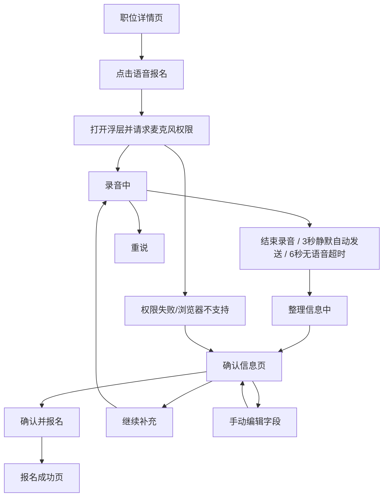

# 语音报名 Demo 交互文档

## 1. 文档说明

- 文档目的：把当前 demo 的真实交互流程、状态分支、异常反馈、手动补充逻辑整理成一份可读、可复用的中文说明。
- 适用范围：仅针对当前仓库实现，不代表未来版本规划。
- 基准来源：
  - 页面装配：`src/App.tsx`
  - 语音状态机：`src/hooks/useVoiceSession.ts`
  - 主浮层页面：`src/components/voiceApply/ApplyScreen.tsx`
  - 底部按钮区：`src/components/voiceApply/ApplyActions.tsx`
  - 职位页：`src/components/voiceApply/JobScreen.tsx`
  - 成功页：`src/components/voiceApply/SuccessScreen.tsx`
  - 引导与错误文案：`src/utils/resumeAssistantPrompts.ts`

## 2. 产品目标

- 目标不是做一个完整招聘 App，而是演示一条清晰的移动端 H5 报名链路：
  - 看职位
  - 点语音报名
  - 直接说关键信息
  - 系统自动整理成报名字段
  - 用户确认或补充
  - 提交成功

- 当前只处理 4 个字段：
  - 年龄
  - 手机号
  - 意向城市
  - 意向职位

- 当前 demo 重点是：
  - 降低填写成本
  - 让蓝领类求职场景“能说完就报名”
  - 对识别失败、少字段、说错字段给出可恢复路径

## 3. 页面结构总览

当前体验由 3 个大层组成：

1. 职位详情页
2. 语音报名浮层
3. 报名成功页

其中语音报名浮层是整个 demo 的核心，内部还分多种状态。

## 4. 整体流程图

## 5. 页面与状态拆解

### 5.1 职位详情页

对应文件：`src/components/voiceApply/JobScreen.tsx`

#### 视觉内容

- 页面底图是职位详情截图。
- 底部固定两个按钮：
  - `在线聊`
  - `语音报名`

#### 当前可交互行为

- `语音报名`：进入报名流程。
- `在线聊`：当前只有视觉按钮，没有接真实逻辑。

#### 设计意图

- 用户先处在熟悉的招聘职位页上下文。
- 报名入口不藏在表单里，而是放在底部主按钮位，强调“一键开始说”。

### 5.2 语音报名浮层

对应文件：

- `src/App.tsx`
- `src/components/voiceApply/ApplyScreen.tsx`
- `src/components/voiceApply/ApplyActions.tsx`
- `src/hooks/useVoiceSession.ts`

#### 浮层的 5 个对外体验状态

虽然底层状态更多，但用户层面可以理解成 5 个阶段：

1. 准备/引导态
2. 录音态
3. 整理中
4. 确认态
5. 异常态

#### 共同结构

浮层内部始终围绕 4 个区域组织：

1. 顶部返回/关闭
2. 标题区
3. 表单区
4. 聊天气泡区或状态区
5. 底部主操作区

#### 顶部按钮规则

- 大多数状态显示“返回箭头”
- 只有完全对话式输入壳时会更接近关闭逻辑
- 关闭后会：
  - 中断录音
  - 清掉当前转写
  - 回到职位页

### 5.3 准备/引导态

典型场景：

- 刚点“语音报名”
- 录音开始前
- 重说后重新等待
- 取消补充后回到待输入

#### 主要表现

- 标题默认是：
  - 副标题：`完善您的简历`
  - 主标题：`您可以这样对我说`

- 中间展示监听提示，不直接堆积聊天记录。

- 底部按钮：
  - 左：`重说`
  - 右：`发送`

#### 设计意图

- 用户第一次进来时，不先抛复杂表单，而是告诉他“可以直接说”。
- 这里更像“准备开口”的语音入口，而不是正式填写页。

### 5.4 录音态

#### 进入方式

- 用户点击语音报名后，`App.tsx` 会先拉起浮层，再延迟约 180ms 启动录音。
- 这样做是为了避免浮层尚未完成动画时就开始录音。

#### 内部关键状态

`useVoiceSession.ts` 中实际会经历：

- `requestingPermission`
- `recording`
- `recognizing`

#### 录音开始前

- 如果麦克风权限还没拿到，先请求权限。
- 如果浏览器不支持，直接进异常恢复路径。

#### 录音中的界面反馈

1. 如果还没有识别出文字：
   - 展示“我在听”的提示态
   - 用户知道系统处于监听中

2. 如果已经有转写文字：
   - 中间改成语音气泡
   - 实时显示当前识别内容

#### 自动行为

当前实现有两个非常关键的自动结束规则：

1. `3 秒无新转写自动发送`
   - 常量：`AUTO_SEND_SILENCE_MS = 3000`
   - 含义不是检测音量静音，而是：
     - 3 秒内没有新的 transcript 更新
     - 就自动走现有结束录音与整理流程

2. `6 秒完全无内容超时`
   - 常量：`NO_SPEECH_TIMEOUT_MS = 6000`
   - 如果用户按了报名，但 6 秒都没有任何转写内容
   - 系统会结束本轮，再进入“没听清”的错误恢复状态

#### 手动结束

- 用户也可以点击底部 `发送`
- 点击后不会立刻提交，而是先进入短暂收尾
- 代码里有一个 `380ms` 的 stop grace period，用于让语音识别有机会吐出最后一段结果

#### 设计意图

- 既保留“说完就走”的快感
- 又避免强制用户必须再按一次结束
- 同时保留手动发送的确定性

### 5.5 整理中

对应状态：`phase === 'extracting'`

#### 主要表现

- 页面会把刚才用户说的话作为用户气泡展示
- 紧接着展示一个助手状态气泡：
  - `正在识别您的信息`
  - 聊天气泡文案层还有一个中间文案：`正在整理报名信息...`

#### 底部按钮

- 左：`重说`
- 右：`发送`

说明：

- 当前实现里“整理中”阶段底部按钮没有完全锁死
- 但视觉主感知仍是“系统正在处理”

#### 设计意图

- 不让用户觉得系统黑箱卡住
- 通过“我听到了什么 -> 我现在在整理”建立过程透明感

### 5.6 确认态

对应状态：`phase === 'review'`

这是整个流程最重要的确认环节。

#### 标题变化

- 副标题仍是：`完善您的简历`
- 主标题切到：`请确认信息`

#### 表单展示

此时表单会展示 4 个关键字段：

- 年龄
- 手机号
- 工作地点
- 意向职位

字段内容来源有两层：

1. 自动识别结果
2. 用户后续手动修改结果

#### 确认态的系统提示文案逻辑

系统会根据字段完整度给出不同引导：

1. `4 项都齐`
   - 提示：`信息整理好了，确认无误后就可以报名。`

2. `缺多个字段`
   - 提示：`还需要补充xxx、xxx。可以一句话说完，也可以点击上方逐项填写。`

3. `只缺 1 个字段`
   - 针对字段给出更具体的话术，例如：
     - 手机号：补充 11 位手机号
     - 职位：可以说普工、包装工、保安、司机
     - 城市：说城市或区县都可以
     - 年龄：例如“我32岁”

4. `一个有效字段都没整理出`
   - 提示：`刚才没整理出有效报名信息。你可以重新说一遍，或直接手动填写。`

#### 底部按钮

确认态有两颗核心按钮：

1. `继续补充`
2. `确认并报名`

#### 按钮规则

- `继续补充`
  - 总是可见
  - 点击后重新进入语音输入，但保留现有已识别信息

- `确认并报名`
  - 只有 4 个字段都有值时才可点击
  - 当前逻辑是“等权必填”

#### 设计意图

- 不把识别结果当最终答案，而是把它当用户确认前的草稿
- 让“说一轮就够了”和“差一点也能补”这两种体验都成立

### 5.7 异常态

#### 当前覆盖的异常类型

语音层主要处理这些错误：

- 浏览器不支持
- 权限拒绝
- 没有听到声音
- 网络异常
- 识别失败
- 用户主动中断

#### 典型错误文案

- 浏览器不支持：
  - `当前浏览器暂不支持语音识别，请切换到支持的手机浏览器。`

- 权限拒绝：
  - 如果是 WebView 或受限环境，更倾向提示改用系统浏览器

- 没听清：
  - `刚才没听清。请再说一次，或手动填写。`

- 网络/识别失败：
  - 引导用户 `再试一次` 或 `手动填写`

#### 异常态的交互原则

- 错误文案必须“可恢复”
- 不允许把用户卡死在不可操作状态
- 即便语音失败，只要能手动补齐 4 项，仍然允许报名

## 6. 手动补充能力

### 6.1 总原则

语音不是唯一入口。任何时候只要已经进入确认态，用户都可以改字段。

### 6.2 年龄编辑

- 入口：点击年龄字段
- 形式：Age picker sheet
- 结果：选中后覆盖当前年龄值

### 6.3 城市编辑

- 入口：点击城市字段
- 形式：City picker sheet
- 规则：
  - 最多可选 3 个城市
  - 超限提示：`只能选3个城市`

### 6.4 手机号编辑

- 入口：点击手机号字段
- 形式：Phone editor sheet
- 规则：
  - 只接受完整手机号
  - 不满 11 位时不能确认

### 6.5 职位编辑

- 入口：点击职位字段
- 形式：Position picker sheet
- 规则：
  - 最多可选 3 个职位
  - 超限提示：`只能选3个职位`

### 6.6 继续补充

这是手动编辑之外的另一条重要补充路径。

- 点击 `继续补充`
- 重新开启录音
- 已识别字段不会被清空
- 新一轮识别只补缺失项，或覆盖本轮识别出的字段

## 7. 成功页

对应文件：`src/components/voiceApply/SuccessScreen.tsx`

### 7.1 进入方式

- 确认态点击 `确认并报名`
- 前提：4 个字段都已填完

### 7.2 页面内容

- 大标题：`报名成功`
- 副提示：`请留意私信消息或手机来电`
- 下面有两个操作按钮：
  - `更新简历`
  - `报名记录`

### 7.3 当前实现边界

- 这两个按钮当前仍是展示型按钮，没有接真实跳转逻辑

### 7.4 附加内容

- 成功页下方还有 `相似职位推荐`
- 每个职位卡带 `报名` 按钮
- 当前也是更偏展示用途

## 8. 状态机说明

### 8.1 业务阶段 `phase`

`useVoiceSession.ts` 中的主业务阶段有 5 个：

- `job`
- `intro`
- `recording`
- `extracting`
- `review`

可以理解为：

- `job`：职位详情页
- `intro`：浮层待说话/可重说
- `recording`：真实录音中
- `extracting`：AI 或本地规则整理中
- `review`：确认报名信息

### 8.2 录音子状态 `recordingState`

录音层还有更细的状态：

- `idle`
- `requestingPermission`
- `recording`
- `recognizing`
- `summarizing`
- `result`
- `error`

### 8.3 两层状态的关系

- `phase` 决定页面看起来处于哪一幕
- `recordingState` 决定这一幕内部是“请求权限”“真实录音”“停止后收尾”“失败”等细节

## 9. 当前交互细节与实现边界

### 9.1 自动发送不是音量级静音检测

这点非常重要。

当前的“自动发送”不是通过麦克风音量或 VAD 判断“你没说话了”，而是：

- 3 秒没有新的识别文本更新
- 就视为这一轮说完了

所以它的真实边界是：

- 如果浏览器识别器很慢
- 或最后一句迟迟没产出 transcript
- 自动发送时机会受影响

### 9.2 浏览器兼容性强依赖系统浏览器

当前项目依赖：

- `SpeechRecognition`
- `webkitSpeechRecognition`

因此：

- iOS 内嵌 WebView
- 某些安卓内嵌浏览器
- 微信/企业微信/飞书内置浏览器

都可能出现权限、兼容性或识别限制。

### 9.3 AI 只负责后置抽取，不负责前端转写

前端说话转文字，先走浏览器原生识别。  
后面的 `/api/resume-agent` 或本地兜底逻辑，才负责把转写文本整理成字段。

所以像：

- `保洁` 听成 `宝杰`
- `普工` 听成 `蒲公`

这类问题，第一层通常是浏览器 ASR 问题，不是模型理解问题。

### 9.4 当前成功页是弱闭环，不是完整业务闭环

报名成功页更像一个演示收尾页：

- 有成功反馈
- 有推荐职位
- 有后续按钮

但还没接完整业务系统。

## 10. 真实交互文案汇总

### 10.1 录音中

- `我在听。可以说年龄、手机号、想去哪里、想做什么工作。`
- `请补充没听清的信息，前面已识别的内容会保留。`
- `听到了，正在结束录音并整理信息。`

### 10.2 整理中

- `正在整理报名信息...`
- `正在识别您的信息`

### 10.3 确认态

- `信息整理好了，确认无误后就可以报名。`
- `还需要补充手机号、意向职位……`
- `刚才没整理出有效报名信息。你可以重新说一遍，或直接手动填写。`

### 10.4 异常态

- `当前浏览器暂不支持语音识别，请切换到支持的手机浏览器。`
- `刚才没听清。请再说一次，或手动填写。`
- `刚才没有整理成功。你可以再试一次，或手动填写报名信息。`

## 11. 当前交互规则清单

- 所有字段当前默认必填，不做优先级区分。
- 城市最多选 3 个。
- 职位最多选 3 个。
- 手机号必须完整才允许确认。
- 继续补充时保留上一轮已识别字段。
- 关闭浮层会中断当前录音并清空本轮转写。
- 成功提交后回到职位页，并显示成功页覆盖层。

## 12. 建议的后续文档拆分

如果后面继续迭代，这份文档建议再拆成 3 份：

1. `交互文档`
   - 面向产品/设计
   - 只写页面、动作、反馈、异常

2. `状态机文档`
   - 面向前端开发
   - 专门写 `phase`、`recordingState`、timer、保留逻辑

3. `语音识别与字段抽取边界文档`
   - 面向后续排障
   - 专门解释浏览器 ASR 与 `/api/resume-agent` 的责任边界

## 13. 本文档结论

当前 demo 的交互主线已经比较完整：

- 有清晰入口
- 有语音主流程
- 有整理态
- 有确认态
- 有继续补充
- 有手动兜底
- 有成功收尾

它最核心的体验价值不在“识别多智能”，而在：

- 让用户敢开口
- 让结果可校对
- 让失败也能继续完成报名

这也是当前版本最适合继续保留和放大的交互骨架。
